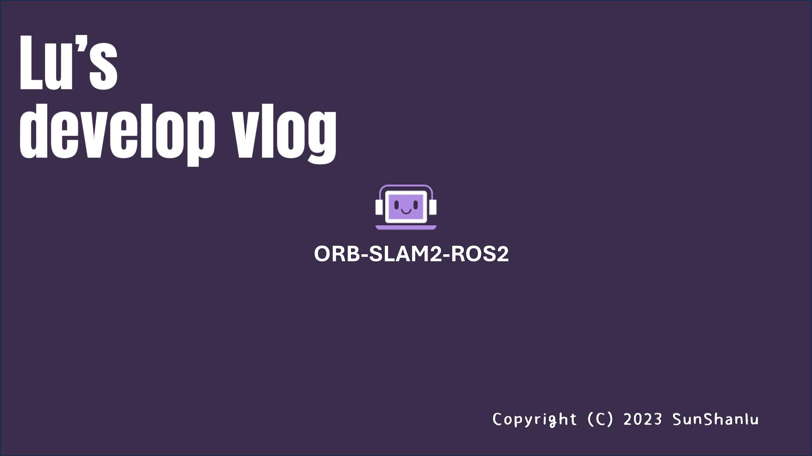
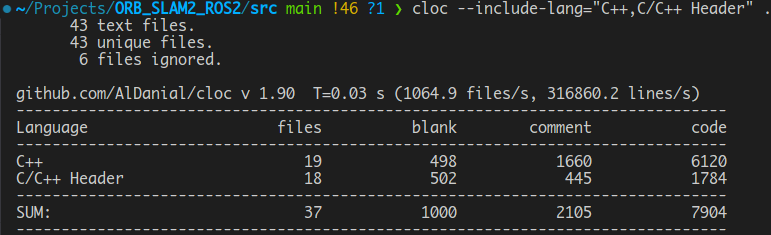

# ORB-SLAM2-ROS2


## 1.介绍

<div align="center">
	<a href="https://www.bilibili.com/video/BV1yi421S73r/?vd_source=9d945accb7548e6244fd39d5aee6126d" title="bilibili:ORB_SLAM2_ROS2">
		
	</a>
</div>

基于`ORB_SLAM2`的原理，对`ORB_SLAM2`进行了完全**重写**。

1. 去掉了`ORB_SLAM2`中，对单目相机的支持，**仅支持**双目和深度相机；
2. 实现了算法和`ROS2`进行了兼容，可以快速融入到基于**ROS2**的项目中去；
3. 基于`C++17`标准，使用**智能指针**代替普通指针，提高内存管理的安全性，但增加了额外的时间开销，使用`execution`策略来提高效率，但与原来`ORB-SLAM2`系统相比，仍存在`20%`的额外时间开销；
4. 基于目前主流的三方库，保证了依赖的**主流兼容性**；
5. 基于**多线程**和**输入输出流**，实现了高效的**地图的保存和加载**功能；
6. `10000`行代码的工作量，使用`cloc`工具统计代码`C++`代码行数如下。

<div align="center">
	
</div>


## 2. 依赖

1. `C++17`
2. `OpenCV 4.2`
3. [`DBoW3`](https://github.com/rmsalinas/DBow3)
4. [`g2o 20241228`](https://github.com/RainerKuemmerle/g2o/tree/20241228_git)
5. [`Pangolin 0.9.3`](https://github.com/stevenlovegrove/Pangolin/tree/v0.9.3)
6. [Sophus 1.24.6](https://github.com/strasdat/Sophus/tree/1.24.6)
7. [ROS2 humble](https://docs.ros.org/en/humble/Installation/Ubuntu-Install-Debians.html)
8. `Eigen3`
9. `cv_bridge`

针对`DBoW3`、`g2o`、`Pangolin`、`Sophus`和`ROS2`，需要去上述给定的地址下载源码，编译安装。

对于没有指定地址的三方库，可以使用如下命令安装：
```shell
sudo apt update
sudo apt install libeigen3-dev ros-humble-cv-bridge
```

## 3. 编译
```shell
git clone https://github.com/sunshanlu/ORB_SLAM2_ROS2.git
cd ORB_SLAM2_ROS2
colcon build
```

## 4. 运行

根据需求，创建配置文件，并运行，配置文件的示例在`config`文件夹中。其中，值得注意的是，在配置文件中有如下选项需要根据文件路径进行修改：
```yaml
Path.Vocabulary: "词袋文件路径，可以是ORB_SLAM2官网的词袋文件，需要解压为txt文件后使用"
Path.BriefTemplate: "BRIEF 描述子模版文件路径，就是confg文件夹下的brief_template.txt文件"
Path.Map: "地图的保存和加载路径，需要提前创建文件夹，指定保存的文件夹路径即可"
```

除此之外，相机的畸变参数信息也需要注意，这里仅支持4参数畸变模型和5参数畸变模型。若要是4畸变参数模型，需要修改的配置文件选项为：
```yaml
Camera.k1: 0.0
Camera.k2: 0.0
Camera.p1: 0.0
Camera.p2: 0.0
```
若要是5畸变参数模型，需要修改的配置文件选项为：
```yaml
Camera.k1: 0.0
Camera.k2: 0.0
Camera.p1: 0.0
Camera.p2: 0.0
Camera.k3: 0.0
```

### 4.1 双目相机KITTI数据集
```shell
source ./install/setup.bash
./install/orb_slam2/lib/orb_slam2/kitti_example kitti_data_seq kitti_config_path
```
1. `kitti_data_seq`，为数据集路径信息，例如 `xxx/KITTI/sequences/00`
2. `kitti_config_path`，为配置文件路径信息，例如 `xxx/config/KITTI_config.yaml`，在`config`文件夹下有对应00数据序列的配置文件示例。

### 4.2 深度相机TUM数据集
```shell
source ./install/setup.bash
./install/orb_slam2/lib/orb_slam2/tum_example tum_data_seq tum_config_path association_path
```
1. `tum_data_seq`，为数据集路径信息，例如 `xxx/dataset/TUM/rgbd_dataset_freiburg2_desk`
2. `tum_config_path`，为配置文件路径信息，例如 `xxx/config/TUM_config.yaml`，在`config`文件夹下有对应`rgbd_dataset_freiburg2_desk`数据序列的配置文件示例。
3. `association_path`, 这是基于TUM的RGBD数据集的工具制作的`RGB`图和深度图的关系文件

### 4.3 ROS2示例
需要在`./src/ORB_SLAM2/example/ROS2/ROSExample.cc`中，将全局变量`ConfigPath`更改为实际的配置文件路径即可。
```shell
source ./install/setup.bash
ros2 run orb_slam2 ros2_example --ros-args -p ConfigPath:=xxx/config/config.yaml
```

1. `ORB_SLAM2/Camera`: 使用的是`orb_slam2_interfaces`中的`Camera`消息类型，当ROS系统接收到此消息后，就会进行跟踪。
   1. 对于双目相机来讲，`Camera.image0`代表的是左图，`Camera.image1`代表的是右图
   2. 对于深度相机来讲，`Camera.image0`代表的是RGB图，`Camera.image1`代表的是深度图
2. `ORB_SLAM2/Pose`: 使用的是`geometry_msgs`中的`PoseStamped`消息类型，当系统完成跟踪后，会向这个话题发布位姿信息。
3. `ORB_SLAM2/Lost`: 使用的是`orb_slam2_interfaces`中的`LostFlag`消息类型，当系统跟踪丢失后，会向这个话题发布丢失信息。